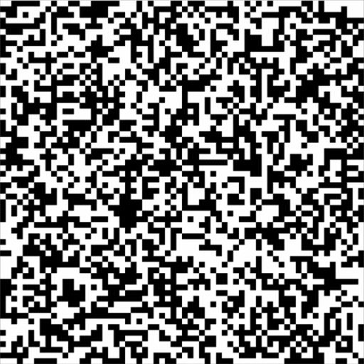

# Conway's Game of Life (RISC-V Assembly)

An implementation of the black-and-white Game of Life with a random starting bitmap, written in RISC-V assembly for the RARS simulator.  
The program uses **memory-mapped graphics** to display a 64×64 grid.

---

## Features

- 64×64 black-and-white Game of Life  
- Random initial state  
- Demonstrates low-level programming, memory manipulation, and bitmap display in RISC-V assembly  
- Fully implemented in assembly (no C/Java/other languages)

---

## Short simulation



---

## How to run the program in RARS

### 1. Install RARS
Download **rars1_6.jar** from:  
[https://github.com/TheThirdOne/rars/releases](https://github.com/TheThirdOne/rars/releases)

### 2. Start RARS
Run the simulator from the terminal:

```bash
java -jar rars1_6.jar
```
### 3. Open the program
Open the .asm file containing the Game of Life source code.

### 4. Configure the Bitmap Display

Go to Tools → Bitmap Display and set the following parameters:
- unit width in pixels: 4
- unit height in pixels: 4
- display width in pixels: 256
- display height in pixels: 256
- base address for display: 0x10040000

Note: The grid must be 64x64 so other settings that are correct may be 8x8 units and 512x512 display or 1x1 units and 64x64

Click **Connect to program** in Bitmap Dispaly window.

### 5. Run simulation
1. Click **Assemble**
2. Click **Run**

The bitmap window will display the evolving Game of Life grid.
The program uses two matrices (matA and matB) for double-buffered computation. Some patterns may continue moving indefinitely due to the rules of the Game of Life.


## Notes

- Tested with RARS 1.6
- Bitmap is 64×64 (4096 bytes)
- Random initial state is generated using RARS RAND_INT syscall
