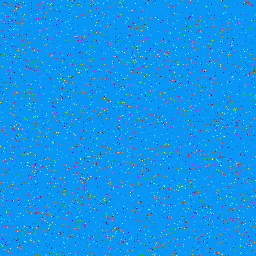
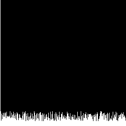

# Bitmap Color Histogram
A histogram generator for .bmp images, implemented using a mix of C and x86 (32-bit) assembly.

The histogram is built not against the full color range, but against a relative palette derived from the bitmap's header (color table).

---

## Features

- Reads 8-bit indexed BMP images together with their color palette (color table)
- Counts pixel occurrences per palette index using a hand-written x86 assembly routine
- Outputs a 256×256 grayscale histogram as a new .bmp file
- Console summary mapping each palette index to its RGB color and pixel count
- Core counting logic fully implemented in assembly, wrapped by a C driver

--- 

## Full example

### Input 
```/examples/fully_sparse_256_colors.bmp```— a 256×256 test bitmap using the full 8-bit palette, dominated by a single sky-blue background color, with the remaining 255 palette colors scattered sparsely across the image (10–30 pixels each).



### Histogram
Histogram is saved as hist.bmp



Note: Bars with >256 pixels are shown at full height (256 pixels)

### Output 
```
Loaded BMP: 256x256 pixels
Histogram values:
Index   0:   60449 pixels | RGB(  9, 151, 245)
Index   1:      30 pixels | RGB( 81,  89,  14)
Index   2:      11 pixels | RGB(137, 249,  58)
Index   3:      25 pixels | RGB(184, 214,  50)
Index   4:      14 pixels | RGB(  8, 145,  62)
Index   5:      22 pixels | RGB(129,  35,  78)
Index   6:      27 pixels | RGB(117, 192, 115)
Index   7:      19 pixels | RGB( 98,  84, 130)
Index   8:      26 pixels | RGB( 47, 243, 112)
Index   9:      19 pixels | RGB( 45,  91, 184)
Index  10:      28 pixels | RGB(115, 177, 169)
Index  11:      26 pixels | RGB(178, 208,  75)
Index  12:      16 pixels | RGB(242,  64, 139)
Index  13:      29 pixels | RGB(173, 121, 137)
Index  14:      20 pixels | RGB( 79, 103, 236)
Index  15:      19 pixels | RGB(  1, 173, 109)
Index  16:      21 pixels | RGB(242, 191, 134)
Index  17:      19 pixels | RGB(255, 229,  65)
Index  18:      19 pixels | RGB( 23, 158,  42)
Index  19:      21 pixels | RGB(219, 120, 116)
Index  20:      30 pixels | RGB(103,  65,  41)
Index  21:      16 pixels | RGB(164, 149, 248)
Index  22:      18 pixels | RGB(249,   4,  93)
Index  23:      27 pixels | RGB( 85, 101, 247)
Index  24:      17 pixels | RGB( 79,   1, 143)
Index  25:      22 pixels | RGB(108,  35, 143)
Index  26:      24 pixels | RGB(160,  25,  75)
Index  27:      29 pixels | RGB( 30, 170, 197)
Index  28:      16 pixels | RGB(232,  38,  61)
Index  29:      21 pixels | RGB(242, 113, 179)
Index  30:      26 pixels | RGB( 99,  10, 240)
Index  31:      15 pixels | RGB(110,  21, 243)
Index  32:      23 pixels | RGB( 26, 202,  29)
Index  33:      12 pixels | RGB( 73,   4, 216)
Index  34:      28 pixels | RGB(221, 108, 190)
Index  35:      26 pixels | RGB( 58,  31,  23)
Index  36:      24 pixels | RGB( 38, 152, 201)
Index  37:      12 pixels | RGB(204, 231,  64)
Index  38:      16 pixels | RGB( 66,  93, 102)
Index  39:      24 pixels | RGB(188,  72, 173)
Index  40:      23 pixels | RGB( 46, 124, 201)
Index  41:      17 pixels | RGB( 18, 199,  69)
Index  42:      17 pixels | RGB(246, 123, 151)
Index  43:      16 pixels | RGB( 33, 205,  90)
Index  44:      13 pixels | RGB(249,   6,  20)
Index  45:      21 pixels | RGB( 48, 155,  91)
Index  46:      29 pixels | RGB(165, 109, 137)
Index  47:      13 pixels | RGB(148,  48, 230)
Index  48:      24 pixels | RGB(  5, 208,  47)
Index  49:      28 pixels | RGB(134, 193,  97)
Index  50:      26 pixels | RGB(225, 212, 235)
Index  51:      30 pixels | RGB( 64,  27,  59)
Index  52:      10 pixels | RGB(224, 216, 103)
Index  53:      25 pixels | RGB( 45, 251, 220)
Index  54:      20 pixels | RGB( 91, 247, 233)
Index  55:      12 pixels | RGB(147,  56, 212)
Index  56:      26 pixels | RGB(  4,  99,  72)
Index  57:      11 pixels | RGB(184, 118, 145)
Index  58:      19 pixels | RGB( 52, 126,  46)
Index  59:      19 pixels | RGB(215, 169,  43)
Index  60:      13 pixels | RGB( 80, 236,   4)
Index  61:      21 pixels | RGB( 84, 191,  19)
Index  62:      27 pixels | RGB( 56, 209, 165)
Index  63:      14 pixels | RGB(168, 181, 239)
Index  64:      16 pixels | RGB( 97, 121, 177)
Index  65:      25 pixels | RGB(197,  26,  29)
Index  66:      13 pixels | RGB( 97, 222, 138)
Index  67:      20 pixels | RGB(174, 141,  39)
Index  68:      14 pixels | RGB(162, 100, 174)
Index  69:      30 pixels | RGB(143, 217, 188)
Index  70:      27 pixels | RGB(207, 111, 201)
Index  71:      10 pixels | RGB(101,  72, 106)
Index  72:      22 pixels | RGB( 39, 207,  93)
Index  73:      13 pixels | RGB(249, 130, 182)
Index  74:      25 pixels | RGB( 60, 159, 152)
Index  75:      26 pixels | RGB( 58, 220,   8)
Index  76:      16 pixels | RGB(  5, 193, 150)
Index  77:      15 pixels | RGB(224, 117,  32)
Index  78:      25 pixels | RGB(128,  63, 185)
Index  79:      11 pixels | RGB(193,  59,  42)
Index  80:      26 pixels | RGB(117, 255, 174)
Index  81:      28 pixels | RGB(206, 251, 101)
Index  82:      28 pixels | RGB(167,  72, 179)
Index  83:      22 pixels | RGB( 85,  37, 205)
Index  84:      23 pixels | RGB(181, 248,   5)
Index  85:      10 pixels | RGB(170, 244, 134)
Index  86:      26 pixels | RGB(222,  93, 143)
Index  87:      23 pixels | RGB(138, 138,  63)
Index  88:      10 pixels | RGB(183, 206, 169)
Index  89:      25 pixels | RGB(  7, 224, 167)
Index  90:      14 pixels | RGB(219,   0, 133)
Index  91:      19 pixels | RGB(208, 144, 228)
Index  92:      15 pixels | RGB(238, 114, 144)
Index  93:      23 pixels | RGB(  7, 193, 231)
Index  94:      24 pixels | RGB(213,   2, 126)
Index  95:      18 pixels | RGB( 90, 221, 243)
Index  96:      12 pixels | RGB(160,  46,  74)
Index  97:      19 pixels | RGB(143,  27, 161)
Index  98:      27 pixels | RGB(203,  68,  17)
Index  99:      16 pixels | RGB(180,  75,  88)
Index 100:      16 pixels | RGB( 13,  86, 173)
Index 101:      11 pixels | RGB(216,  40,  16)
Index 102:      29 pixels | RGB(216, 154, 212)
Index 103:      14 pixels | RGB( 51, 237, 190)
Index 104:      13 pixels | RGB(183, 185, 183)
Index 105:      24 pixels | RGB(170,  51, 101)
Index 106:      30 pixels | RGB(183, 157, 217)
Index 107:      14 pixels | RGB( 40, 249, 228)
Index 108:      16 pixels | RGB( 17,  18,  37)
Index 109:      11 pixels | RGB(236, 251,  17)
Index 110:      11 pixels | RGB(205,  34,  35)
Index 111:      25 pixels | RGB(190, 241, 171)
Index 112:      13 pixels | RGB(211,  52,  57)
Index 113:      28 pixels | RGB( 68, 248, 139)
Index 114:      10 pixels | RGB(141, 210, 119)
Index 115:      25 pixels | RGB(243, 177,  57)
Index 116:      21 pixels | RGB(225, 109, 247)
Index 117:      18 pixels | RGB(  2, 220, 244)
Index 118:      13 pixels | RGB(171, 142,  40)
Index 119:      22 pixels | RGB(245, 214, 144)
Index 120:      29 pixels | RGB(209,   4,  21)
Index 121:      18 pixels | RGB(217,  27, 107)
Index 122:      11 pixels | RGB( 39,  10, 148)
Index 123:      18 pixels | RGB(175, 215,  82)
Index 124:      25 pixels | RGB( 51, 139, 239)
Index 125:      24 pixels | RGB(236,   6,  77)
Index 126:      28 pixels | RGB( 60,  93, 217)
Index 127:      15 pixels | RGB( 48,  10, 218)
Index 128:      21 pixels | RGB(231,  92, 230)
Index 129:      18 pixels | RGB( 62,   7, 142)
Index 130:      22 pixels | RGB(227, 240, 173)
Index 131:      15 pixels | RGB( 98,  65, 247)
Index 132:      16 pixels | RGB(172, 102, 129)
Index 133:      20 pixels | RGB(209, 163, 183)
Index 134:      13 pixels | RGB(243, 159, 130)
Index 135:      19 pixels | RGB( 40, 122, 150)
Index 136:      29 pixels | RGB( 29, 249, 239)
Index 137:      25 pixels | RGB(151, 178, 251)
Index 138:      26 pixels | RGB( 82,   3, 221)
Index 139:      20 pixels | RGB(206, 251,  88)
Index 140:      14 pixels | RGB(190, 248,  83)
Index 141:      19 pixels | RGB(235, 192, 140)
Index 142:      26 pixels | RGB( 17,  74,  53)
Index 143:      13 pixels | RGB( 15, 113,  29)
Index 144:      12 pixels | RGB(207,  58, 135)
Index 145:      20 pixels | RGB( 73, 191, 222)
Index 146:      18 pixels | RGB( 87,  85,  59)
Index 147:      23 pixels | RGB(162, 105, 161)
Index 148:      18 pixels | RGB(155,  35, 155)
Index 149:      14 pixels | RGB(100, 165, 195)
Index 150:      23 pixels | RGB(150, 154,  38)
Index 151:      13 pixels | RGB(183, 132, 112)
Index 152:      22 pixels | RGB( 79, 249,  91)
Index 153:      13 pixels | RGB(152, 251, 135)
Index 154:      13 pixels | RGB(163, 121,   2)
Index 155:      17 pixels | RGB(126,  47, 203)
Index 156:      15 pixels | RGB(114, 202, 127)
Index 157:      29 pixels | RGB( 69,  19,  75)
Index 158:      12 pixels | RGB(105, 244,  89)
Index 159:      20 pixels | RGB(163,  82,  27)
Index 160:      17 pixels | RGB(241, 211,  40)
Index 161:      20 pixels | RGB( 81, 196, 130)
Index 162:      14 pixels | RGB( 58, 106,  37)
Index 163:      11 pixels | RGB( 71, 109, 241)
Index 164:      30 pixels | RGB(241, 138,  26)
Index 165:      20 pixels | RGB( 59, 145,  22)
Index 166:      11 pixels | RGB(197, 201, 249)
Index 167:      22 pixels | RGB( 15, 110, 134)
Index 168:      11 pixels | RGB(183,  31,  63)
Index 169:      26 pixels | RGB(255,   2, 241)
Index 170:      17 pixels | RGB( 80,  24, 185)
Index 171:      16 pixels | RGB(163,  51,  91)
Index 172:      24 pixels | RGB( 63,  68,  61)
Index 173:      24 pixels | RGB( 21,  88, 253)
Index 174:      28 pixels | RGB( 41,  79,  76)
Index 175:      16 pixels | RGB( 81,  41, 216)
Index 176:      22 pixels | RGB( 65,  73, 244)
Index 177:      13 pixels | RGB(230, 228, 162)
Index 178:      25 pixels | RGB(172, 173, 244)
Index 179:      18 pixels | RGB( 56,   9,  44)
Index 180:      24 pixels | RGB( 62, 178, 167)
Index 181:      24 pixels | RGB( 18, 168, 144)
Index 182:      24 pixels | RGB(249,  81, 211)
Index 183:      24 pixels | RGB( 24, 110, 158)
Index 184:      25 pixels | RGB( 78, 223, 137)
Index 185:      19 pixels | RGB( 76, 138, 130)
Index 186:      22 pixels | RGB(117, 199, 154)
Index 187:      21 pixels | RGB(143,  57, 202)
Index 188:      14 pixels | RGB( 62, 185,  87)
Index 189:      10 pixels | RGB( 16, 229,  40)
Index 190:      22 pixels | RGB(116, 166, 138)
Index 191:      23 pixels | RGB(214,  82,  27)
Index 192:      18 pixels | RGB(182,  23,  27)
Index 193:      25 pixels | RGB(247, 235, 234)
Index 194:      21 pixels | RGB(215,  79,  64)
Index 195:      10 pixels | RGB(  4, 132, 216)
Index 196:      24 pixels | RGB(122,  73, 254)
Index 197:      28 pixels | RGB(106, 143, 100)
Index 198:      25 pixels | RGB(213,  24, 199)
Index 199:      10 pixels | RGB(164, 171, 245)
Index 200:      14 pixels | RGB(238, 155, 107)
Index 201:      15 pixels | RGB( 16,   3,  38)
Index 202:      20 pixels | RGB(177,  63,  66)
Index 203:      26 pixels | RGB(220, 195, 233)
Index 204:      30 pixels | RGB(190, 132,  73)
Index 205:      30 pixels | RGB( 46,   0,  90)
Index 206:      29 pixels | RGB(194, 250, 233)
Index 207:      20 pixels | RGB( 72,  31, 113)
Index 208:      24 pixels | RGB(201,  47, 160)
Index 209:      26 pixels | RGB(  2,  42, 153)
Index 210:      26 pixels | RGB(198, 118, 127)
Index 211:      13 pixels | RGB( 91, 125, 159)
Index 212:      27 pixels | RGB(189,  15, 176)
Index 213:      23 pixels | RGB(239, 209,  11)
Index 214:      22 pixels | RGB( 77, 186,  19)
Index 215:      16 pixels | RGB( 66, 130,  86)
Index 216:      24 pixels | RGB(238,  84,  53)
Index 217:      11 pixels | RGB(240,  94, 131)
Index 218:      27 pixels | RGB(216, 138, 218)
Index 219:      25 pixels | RGB( 79,  75, 189)
Index 220:      10 pixels | RGB(120, 102, 100)
Index 221:      11 pixels | RGB(214,  74, 106)
Index 222:      27 pixels | RGB(239,  90, 138)
Index 223:      13 pixels | RGB(140, 130, 182)
Index 224:      16 pixels | RGB( 52,  73, 139)
Index 225:      14 pixels | RGB( 55,  28,  22)
Index 226:      21 pixels | RGB(213, 153, 147)
Index 227:      13 pixels | RGB(248, 228,   3)
Index 228:      11 pixels | RGB(102,  27,  81)
Index 229:      29 pixels | RGB(192, 147, 198)
Index 230:      17 pixels | RGB(146, 102, 156)
Index 231:      15 pixels | RGB(172, 100, 160)
Index 232:      22 pixels | RGB(205,  61, 216)
Index 233:      24 pixels | RGB(180, 126,  69)
Index 234:      19 pixels | RGB(143,  17, 246)
Index 235:      29 pixels | RGB(  2, 124, 150)
Index 236:      12 pixels | RGB( 22, 208, 169)
Index 237:      27 pixels | RGB( 56, 185,  68)
Index 238:      12 pixels | RGB(216, 144, 123)
Index 239:      10 pixels | RGB(157, 193, 171)
Index 240:      16 pixels | RGB(107,  43, 248)
Index 241:      22 pixels | RGB(135, 229, 220)
Index 242:      22 pixels | RGB(179,  77,  53)
Index 243:      18 pixels | RGB(217, 215,  49)
Index 244:      23 pixels | RGB(230,  13, 222)
Index 245:      24 pixels | RGB(233, 169,  62)
Index 246:      27 pixels | RGB(105, 114,  98)
Index 247:      15 pixels | RGB(192, 232, 180)
Index 248:      25 pixels | RGB(191, 241,  91)
Index 249:      24 pixels | RGB(219, 132, 104)
Index 250:      28 pixels | RGB(  1,  64,  24)
Index 251:      18 pixels | RGB( 23, 198, 106)
Index 252:      22 pixels | RGB(  2, 163, 150)
Index 253:      20 pixels | RGB(235,  86, 208)
Index 254:      17 pixels | RGB( 94, 141, 252)
Index 255:      11 pixels | RGB(126, 111, 119)
```

---

## How to build and run

### Requirements

- GCC with 32-bit support (-m32)
- NASM (or a compatible x86 assembler)

### 1.Build the project

```bash
make
```
This compiles main.c with GCC and assembles histogram.asm with NASM (both targeting 32-bit), then links them into the histogram executable.

### 2. Run the program

```bash
./histogram input.bmp
```

A hist.bmp file is generated, visualizing the histogram as a 256×256 grayscale bar chart — one column per palette index, bar height proportional to pixel count.

---

## Notes

- Only 8-bit indexed BMP files are supported (no 24/32-bit RGB BMPs)
- Input images can be of any width and height (not limited to 256×256)
- Histogram bars are capped at a height of 256 pixels regardless of actual pixel count
- The color palette is read directly from the BMP header, not hardcoded